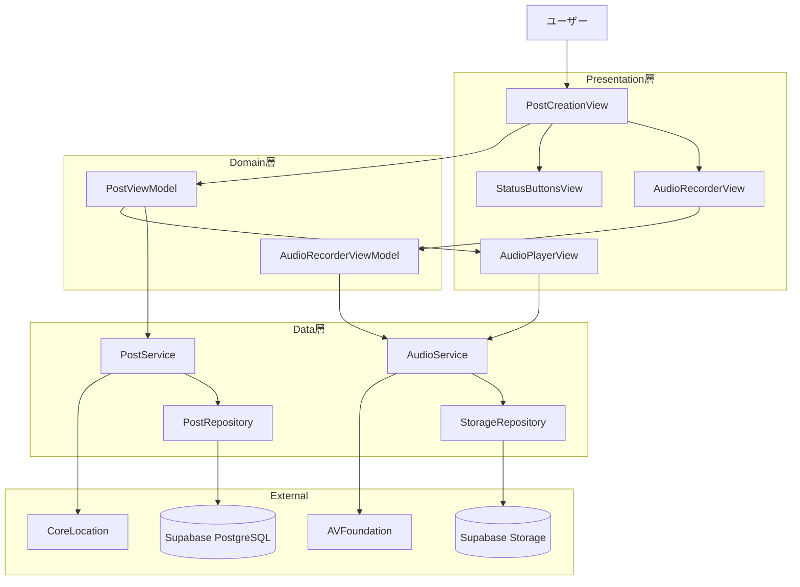
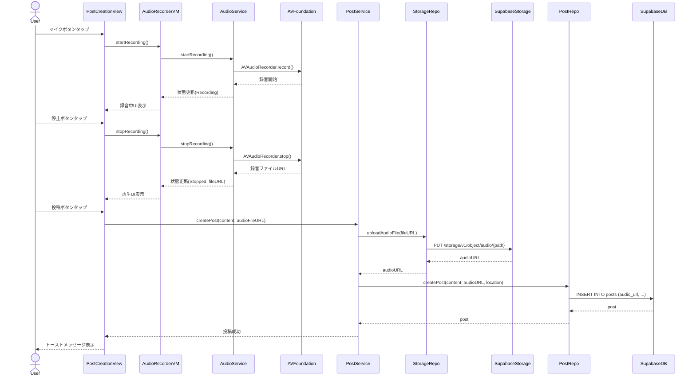
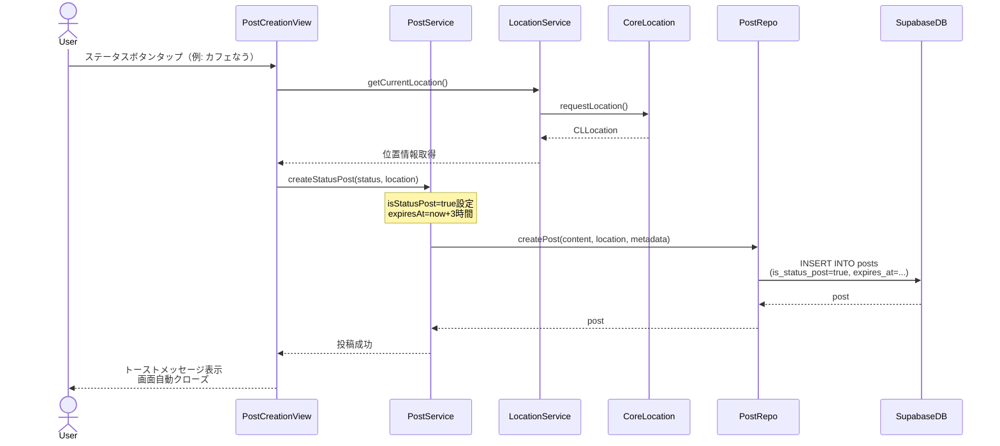
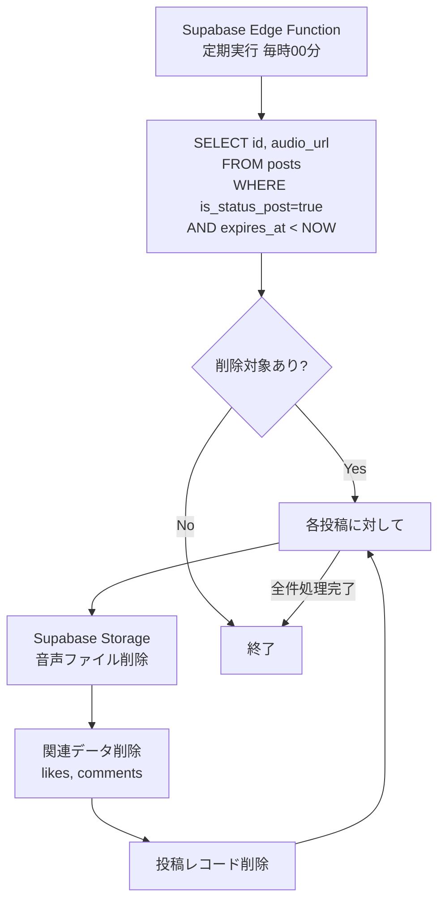
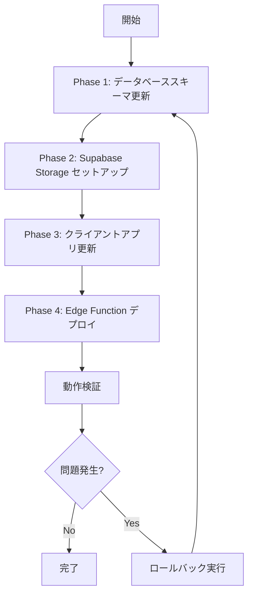

# 技術設計書

## 概要

本設計書は、既存LocationNewsSNSアプリに音声メッセージ投稿機能とワンタップステータス共有機能を追加するための技術設計を定義する。これらの機能は、ユーザーの投稿ハードルを劇的に削減し、アプリのエンゲージメントを向上させる。

**目的**: 投稿作成時間を平均30秒から5秒に短縮し、新規ユーザーの初回投稿完了率を50%向上させる。

**対象ユーザー**: LocationNewsSNSアプリのすべてのユーザー。特に移動中や片手操作時に投稿したいユーザー、テキスト入力が苦手なユーザー。

**影響範囲**: 既存の投稿作成フロー、Post データモデル、Supabase スキーマ、地図表示ロジックを拡張する。

### ゴール

- 音声録音から投稿完了まで最短5秒で完了
- ステータス投稿はワンタップで完了（1秒以内）
- 既存の投稿機能との完全な互換性維持
- 音声ファイルの安全なアップロードとストリーミング再生
- ステータス投稿の自動削除によるプライバシー保護

### 非ゴール

- リアルタイム音声通話機能（将来検討）
- 音声エフェクト・編集機能（v1では除外）
- ステータス投稿のカスタマイズ機能（プリセットのみ）
- 音声の自動文字起こし機能（将来検討）
- 音声ファイルの圧縮最適化（iOS標準のAACを使用）

---

## アーキテクチャ

### 既存アーキテクチャ分析

LocationNewsSNSは以下のアーキテクチャパターンに従っている:

**アーキテクチャパターン**: MVVM + Clean Architecture
- **Presentation層** (Views/): SwiftUI View + ViewModel
- **Domain層** (Models/, UseCases/): エンティティ、ビジネスロジック
- **Data層** (Services/, Repositories/): データアクセス、外部API連携
- **Infrastructure層** (Configuration/, Storage/): 設定、ローカルストレージ

**既存の投稿フロー**:
1. PostCreationView → ユーザー入力受付
2. PostService → ビジネスロジック処理
3. PostRepository → Supabase API呼び出し
4. Supabase → PostgreSQL + Storage

**統合ポイント**:
- PostCreationView: 音声録音UI、ステータスボタンUIを追加
- Post モデル: audioURL, isStatusPost, expiresAt フィールドを追加
- PostService: 音声アップロード、ステータス投稿ロジックを追加
- Supabase Storage: audio/ バケットを作成

###高レベルアーキテクチャ



**アーキテクチャ統合**:
- **既存パターン維持**: MVVM + Clean Architecture をそのまま踏襲
- **新規コンポーネント追加理由**:
  - AudioService: 音声録音・再生・アップロードの責務を分離
  - AudioRecorderViewModel: 録音UI状態管理を分離
  - StorageRepository: Supabase Storage専用のリポジトリ層
- **技術スタック整合性**: SwiftUI, AVFoundation, Supabase SDKはすべて既存スタックと一致
- **Steering準拠**: Clean Architectureの層分離原則、MVVM パターンを遵守

---

## 技術スタック整合性

既存のLocationNewsSNSアプリの技術スタックに完全に準拠する。

### 既存技術スタックとの統合

**フロントエンド (iOS)**:
- SwiftUI (iOS 18+): 既存のViewに音声録音UIを統合
- AVFoundation: 音声録音・再生機能（新規追加）
- CoreLocation: 既存の位置情報サービスを再利用
- Combine: 既存のリアクティブプログラミングパターンを継承

**バックエンド (Supabase)**:
- PostgreSQL: posts テーブルにカラム追加（audio_url, is_status_post, expires_at）
- Supabase Storage: audio/ バケット新規作成
- Supabase Edge Functions: 自動削除ジョブを追加

**新規依存関係**:
なし（AVFoundationはiOS標準フレームワーク）

---

## 主要設計決定

### 決定1: 音声ファイル形式とアップロード戦略

**決定**: AAC形式（.m4a）でローカル録音し、Supabase Storageに直接アップロード

**コンテキスト**: 音声ファイルは30秒で約500KB〜1MBになる可能性があり、ネットワーク負荷とストレージコストのバランスが必要。

**代替案**:
1. **Opus形式で圧縮してアップロード**: より小さいファイルサイズだが、iOSネイティブサポート がなく、エンコード/デコードに追加ライブラリが必要
2. **Base64エンコードしてPostgreSQLに保存**: シンプルだが、DBサイズが肥大化し、ストリーミング再生が困難
3. **AWS S3にアップロード**: 柔軟性は高いが、既存のSupabase統合から逸脱

**選択したアプローチ**: AAC (.m4a) + Supabase Storage
- AVFoundationでネイティブサポート（コード量最小）
- Supabase Storageは既存インフラで追加コストなし
- ストリーミング再生が容易（HTTPSでダウンロード）
- 44.1kHz, 128kbpsで音質と容量のバランスが最適

**根拠**:
- iOSネイティブ機能のみで実装可能（追加依存なし）
- 既存のSupabase統合を最大限活用
- 音声ファイルサイズは30秒で約0.5MB（許容範囲内）

**トレードオフ**:
- **得るもの**: 実装の単純さ、既存インフラ活用、開発速度
- **失うもの**: ファイルサイズの最適化（Opusより1.5倍程度大きい）

### 決定2: ステータス投稿の自動削除実装

**決定**: Supabase Edge Function（定期実行）で3時間経過した投稿を削除

**コンテキスト**: プライバシー保護のため、ステータス投稿は3時間後に自動削除が必要。クライアント側での削除は信頼性が低い。

**代替案**:
1. **PostgreSQL TTL機能**: 自動削除は可能だが、関連データ（いいね、コメント）のカスケード削除が複雑
2. **クライアント側で削除**: アプリが閉じられていると削除されない
3. **pg_cronでPostgreSQLジョブ**: Supabaseの無料プランでは利用不可

**選択したアプローチ**: Supabase Edge Function（定期実行）
- 毎時実行され、expires_at < NOW() の投稿を検索して削除
- 関連データ（いいね、コメント、音声ファイル）も同時削除
- サーバーサイドで確実に実行される

**根拠**:
- Supabase Edge Functionは既存インフラ内で利用可能
- サーバーサイド実行により確実性を担保
- カスケード削除ロジックを集約管理できる

**トレードオフ**:
- **得るもの**: 確実な自動削除、プライバシー保護
- **失うもの**: リアルタイム削除ではない（最大1時間の遅延）

### 決定3: 音声録音UIの状態管理

**決定**: 独立したAudioRecorderViewModelで録音状態を管理

**コンテキスト**: 音声録音は複雑な状態遷移（待機→録音中→録音完了→再生）があり、投稿作成フローとは独立している。

**代替案**:
1. **PostViewModelに統合**: シンプルだが、ViewModelが肥大化し、単一責任原則に違反
2. **View内で@State管理**: 状態ロジックがViewに混在し、テスト困難
3. **Combineで複雑なストリームを構築**: 過度に複雑で保守性が低下

**選択したアプローチ**: 独立したAudioRecorderViewModel
- 録音状態（Idle, Recording, Stopped, Playing）を管理
- AVAudioRecorderのライフサイクルを管理
- PostViewModelとは疎結合

**根拠**:
- 単一責任原則に準拠（録音ロジックの責務分離）
- テスタビリティ向上（録音ロジックを独立テスト可能）
- 再利用性向上（他の画面でも音声録音が必要になった場合）

**トレードオフ**:
- **得るもの**: 保守性、テスタビリティ、再利用性
- **失うもの**: ViewModel数の増加（わずかな複雑性の増加）

---

## システムフロー

### 音声メッセージ投稿フロー



### ワンタップステータス投稿フロー



### ステータス投稿自動削除フロー



---

## コンポーネントとインターフェース

### Presentation層

#### AudioRecorderView

**責務と境界**:
- **主要責務**: 音声録音UIの表示と録音制御
- **ドメイン境界**: Presentation層（View）
- **データ所有**: なし（ViewModelに委譲）
- **トランザクション境界**: なし

**依存関係**:
- **Inbound**: PostCreationView
- **Outbound**: AudioRecorderViewModel
- **External**: なし

**コントラクトDefinition**:

```swift
struct AudioRecorderView: View {
    @ObservedObject var viewModel: AudioRecorderViewModel

    var body: some View {
        // 録音UI実装
    }
}
```

- **事前条件**: AudioRecorderViewModelがインジェクトされている
- **事後条件**: ユーザー操作に応じてViewModelのメソッドを呼び出す
- **不変条件**: 録音中は他の投稿操作をブロック

**状態管理**:
- **状態モデル**: Idle → Recording → Stopped → Playing → Idle
- **永続化**: なし（メモリ内のみ）
- **並行性制御**: @MainActorで UI スレッド保証

#### StatusButtonsView

**責務と境界**:
- **主要責務**: プリセットステータスボタン一覧の表示と選択
- **ドメイン境界**: Presentation層（View）
- **データ所有**: なし
- **トランザクション境界**: なし

**依存関係**:
- **Inbound**: PostCreationView
- **Outbound**: なし（@Binding経由で親Viewに通知）
- **External**: なし

**コントラクトDefinition**:

```swift
struct StatusButtonsView: View {
    @Binding var selectedStatus: StatusType?
    let statuses: [StatusType] = [
        .cafe, .lunch, .walking, .studying,
        .free, .event, .moving, .movie
    ]

    var body: some View {
        // ステータスボタン一覧実装
    }
}

enum StatusType: String, CaseIterable {
    case cafe = "☕ カフェなう"
    case lunch = "🍴 ランチ中"
    case walking = "🚶 散歩中"
    case studying = "📚 勉強中"
    case free = "😴 暇してる"
    case event = "🎉 イベント参加中"
    case moving = "🏃 移動中"
    case movie = "🎬 映画鑑賞中"
}
```

- **事前条件**: なし
- **事後条件**: 選択されたステータスを@Binding経由で親Viewに通知
- **不変条件**: 一度に1つのステータスのみ選択可能

#### AudioPlayerView

**責務と境界**:
- **主要責務**: 音声ファイルの再生UIと再生制御
- **ドメイン境界**: Presentation層（View）
- **データ所有**: なし
- **トランザクション境界**: なし

**依存関係**:
- **Inbound**: PostDetailView, NearbyPostCardView
- **Outbound**: AudioService
- **External**: AVFoundation

**コントラクトDefinition**:

```swift
struct AudioPlayerView: View {
    let audioURL: URL
    @StateObject private var audioService: AudioService
    @State private var isPlaying: Bool = false
    @State private var currentTime: TimeInterval = 0
    @State private var duration: TimeInterval = 0

    var body: some View {
        // 再生UI実装
    }
}
```

- **事前条件**: 有効な音声ファイルURLが渡される
- **事後条件**: ユーザー操作に応じて音声を再生・一時停止
- **不変条件**: 再生中は他の音声プレイヤーを停止

---

### Domain層

#### AudioRecorderViewModel

**責務と境界**:
- **主要責務**: 音声録音の状態管理とビジネスロジック
- **ドメイン境界**: Presentation層（ViewModel）
- **データ所有**: 録音状態、録音ファイルURL
- **トランザクション境界**: なし

**依存関係**:
- **Inbound**: AudioRecorderView
- **Outbound**: AudioService
- **External**: なし

**コントラクトDefinition**:

```swift
@MainActor
class AudioRecorderViewModel: ObservableObject {
    @Published var recordingState: RecordingState = .idle
    @Published var recordingTime: TimeInterval = 0
    @Published var audioFileURL: URL?
    @Published var errorMessage: String?

    private let audioService: AudioService
    private let maxRecordingTime: TimeInterval = 30

    init(audioService: AudioService = AudioService())

    func startRecording() async throws
    func stopRecording() async throws
    func playRecording() async throws
    func stopPlaying()
    func deleteRecording()
}

enum RecordingState {
    case idle
    case recording
    case stopped
    case playing
}
```

- **事前条件**: マイクアクセス許可が必要
- **事後条件**: 録音成功時はaudioFileURLを設定
- **不変条件**: 録音時間は最大30秒

#### PostViewModel (既存拡張)

**責務と境界**:
- **主要責務**: 投稿作成・編集のビジネスロジック（音声投稿、ステータス投稿を含む）
- **ドメイン境界**: Presentation層（ViewModel）
- **データ所有**: 投稿内容、選択されたステータス、音声ファイルURL
- **トランザクション境界**: なし

**依存関係**:
- **Inbound**: PostCreationView
- **Outbound**: PostService, LocationService
- **External**: なし

**コントラクトDefinition**（既存に追加）:

```swift
@MainActor
class PostViewModel: ObservableObject {
    // 既存プロパティ
    @Published var content: String = ""
    @Published var isLoading: Bool = false

    // 新規追加プロパティ
    @Published var selectedStatus: StatusType?
    @Published var audioFileURL: URL?
    @Published var isStatusPost: Bool = false

    private let postService: PostService
    private let locationService: LocationService

    // 既存メソッド
    func createPost() async throws

    // 新規追加メソッド
    func createStatusPost(status: StatusType) async throws
    func createPostWithAudio(audioURL: URL) async throws
}
```

- **事前条件**: 位置情報取得済み
- **事後条件**: 投稿成功時はPostServiceを通じてSupabaseに保存
- **不変条件**: ステータス投稿は自動削除フラグ付きで作成

---

### Data層

#### AudioService

**責務と境界**:
- **主要責務**: 音声録音・再生・アップロードの実行
- **ドメイン境界**: Data層（Service）
- **データ所有**: AVAudioRecorder/AVAudioPlayerインスタンス
- **トランザクション境界**: なし

**依存関係**:
- **Inbound**: AudioRecorderViewModel, AudioPlayerView
- **Outbound**: StorageRepository
- **External**: AVFoundation

**コントラクトDefinition**:

```swift
@MainActor
class AudioService: ObservableObject {
    private var audioRecorder: AVAudioRecorder?
    private var audioPlayer: AVAudioPlayer?
    private let storageRepository: StorageRepositoryProtocol

    init(storageRepository: StorageRepositoryProtocol = StorageRepository())

    // 録音
    func startRecording() async throws -> URL
    func stopRecording() -> URL
    func requestMicrophonePermission() async -> Bool

    // 再生
    func playAudio(from url: URL) async throws
    func pauseAudio()
    func seekToTime(_ time: TimeInterval)
    func getCurrentTime() -> TimeInterval
    func getDuration() -> TimeInterval

    // アップロード
    func uploadAudioFile(_ fileURL: URL, userID: UUID) async throws -> String
    func deleteAudioFile(at path: String) async throws
}
```

- **事前条件**: マイクアクセス許可（録音時）、ネットワーク接続（アップロード時）
- **事後条件**: 録音成功時はローカルファイルURLを返す、アップロード成功時はSupabase Storage URLを返す
- **不変条件**: 同時に1つの録音/再生セッションのみ

**外部依存調査**: AVFoundation

AVFoundationはApple標準フレームワークであり、外部ライブラリではないが、主要APIを記載:

- **AVAudioRecorder**: 音声録音API
  - `record()`: 録音開始
  - `stop()`: 録音停止
  - 設定: AVFormatIDKey = kAudioFormatMPEG4AAC, AVSampleRateKey = 44100, AVEncoderBitRateKey = 128000
- **AVAudioPlayer**: 音声再生API
  - `play()`: 再生開始
  - `pause()`: 一時停止
  - `currentTime`: 再生位置取得/設定

#### PostService (既存拡張)

**責務と境界**:
- **主要責務**: 投稿のCRUD操作（音声投稿、ステータス投稿を含む）
- **ドメイン境界**: Data層（Service）
- **データ所有**: なし（Repositoryに委譲）
- **トランザクション境界**: なし

**依存関係**:
- **Inbound**: PostViewModel
- **Outbound**: PostRepository, AudioService
- **External**: なし

**コントラクトDefinition**（既存に追加）:

```swift
@MainActor
class PostService: ObservableObject {
    private let postRepository: PostRepositoryProtocol
    private let audioService: AudioService

    init(
        postRepository: PostRepositoryProtocol = PostRepository(),
        audioService: AudioService = AudioService()
    )

    // 新規追加メソッド
    func createPostWithAudio(
        content: String,
        audioFileURL: URL,
        location: CLLocationCoordinate2D
    ) async throws -> Post

    func createStatusPost(
        status: String,
        location: CLLocationCoordinate2D
    ) async throws -> Post
}
```

- **事前条件**: 有効な位置情報とコンテンツ
- **事後条件**: 投稿がSupabaseに保存され、Postオブジェクトを返す
- **不変条件**: ステータス投稿はexpiresAtが現在時刻+3時間に設定される

#### StorageRepository

**責務と境界**:
- **主要責務**: Supabase Storageへのファイルアップロード・削除
- **ドメイン境界**: Data層（Repository）
- **データ所有**: なし
- **トランザクション境界**: なし

**依存関係**:
- **Inbound**: AudioService
- **Outbound**: Supabase Storage SDK
- **External**: Supabase Storage

**コントラクトDefinition**:

```swift
protocol StorageRepositoryProtocol {
    func uploadFile(
        bucket: String,
        path: String,
        data: Data
    ) async throws -> String

    func deleteFile(
        bucket: String,
        path: String
    ) async throws

    func getPublicURL(
        bucket: String,
        path: String
    ) -> String
}

class StorageRepository: StorageRepositoryProtocol {
    private let supabase: SupabaseClient

    init(supabase: SupabaseClient = SupabaseConfig.shared.client)

    func uploadFile(
        bucket: String,
        path: String,
        data: Data
    ) async throws -> String

    func deleteFile(
        bucket: String,
        path: String
    ) async throws

    func getPublicURL(
        bucket: String,
        path: String
    ) -> String
}
```

- **事前条件**: 有効なSupabaseクライアント、ネットワーク接続
- **事後条件**: アップロード成功時はpublic URLを返す
- **不変条件**: バケット名は"audio"固定

**外部依存調査**: Supabase Storage

- **API**: Supabase Swift SDK (`SupabaseClient.storage`)
- **認証**: JWT トークン（既存のSupabase Auth統合）
- **アップロード**: `storage.from(bucket).upload(path:data:)`
- **削除**: `storage.from(bucket).remove([path])`
- **URL取得**: `storage.from(bucket).getPublicURL(path:)`
- **RLSポリシー**: 自分の音声ファイルのみアップロード・削除可能

---

## データモデル

### Physical Data Model

#### posts テーブル拡張

既存のpostsテーブルに以下のカラムを追加:

| カラム名 | データ型 | NULL許可 | デフォルト | 説明 |
|---------|---------|---------|----------|------|
| audio_url | TEXT | YES | NULL | Supabase Storage上の音声ファイルURL |
| is_status_post | BOOLEAN | NO | FALSE | ステータス投稿フラグ |
| expires_at | TIMESTAMP WITH TIME ZONE | YES | NULL | 自動削除予定日時（ステータス投稿のみ） |

**インデックス追加**:
```sql
CREATE INDEX idx_posts_expires_at ON posts(expires_at)
WHERE is_status_post = true AND expires_at IS NOT NULL;
```

#### Supabase Storage構造

**Bucket**: `audio`

**ファイルパス構造**:
```
audio/
├── {user_id}/
│   ├── {timestamp}_{uuid}.m4a
│   ├── {timestamp}_{uuid}.m4a
│   └── ...
```

**RLSポリシー**:
```sql
-- アップロード: 自分のフォルダにのみ可能
CREATE POLICY "Users can upload to their own folder"
ON storage.objects FOR INSERT
WITH CHECK (
    bucket_id = 'audio' AND
    (storage.foldername(name))[1] = auth.uid()::text
);

-- 削除: 自分のファイルのみ可能
CREATE POLICY "Users can delete their own files"
ON storage.objects FOR DELETE
USING (
    bucket_id = 'audio' AND
    (storage.foldername(name))[1] = auth.uid()::text
);

-- 読み取り: すべてのユーザーが可能（公開投稿）
CREATE POLICY "Anyone can read audio files"
ON storage.objects FOR SELECT
USING (bucket_id = 'audio');
```

### Domain Model

#### Post エンティティ拡張

```swift
struct Post: Codable, Identifiable {
    let id: UUID
    let user: UserProfile
    let content: String
    let url: String?
    let latitude: Double?
    let longitude: Double?
    let address: String?
    let category: PostCategory
    let visibility: PostVisibility
    let isUrgent: Bool
    let isVerified: Bool
    let likeCount: Int
    let commentCount: Int
    let shareCount: Int
    let createdAt: Date
    let updatedAt: Date

    // 新規追加フィールド
    let audioURL: String?
    let isStatusPost: Bool
    let expiresAt: Date?

    // 計算プロパティ
    var isExpired: Bool {
        guard let expiresAt = expiresAt else { return false }
        return Date() > expiresAt
    }

    var remainingTime: TimeInterval? {
        guard let expiresAt = expiresAt else { return nil }
        return expiresAt.timeIntervalSinceNow
    }

    enum CodingKeys: String, CodingKey {
        // ... 既存のCodingKeys
        case audioURL = "audio_url"
        case isStatusPost = "is_status_post"
        case expiresAt = "expires_at"
    }
}
```

**ビジネスルール**:
- ステータス投稿の場合、`isStatusPost = true` かつ `expiresAt = 作成日時 + 3時間`
- 音声投稿の場合、`audioURL != null`
- ステータス投稿と音声投稿は組み合わせ可能

---

## エラーハンドリング

### エラー戦略

各エラーカテゴリに対して具体的なハンドリング戦略を定義する。

### エラーカテゴリと対応

#### ユーザーエラー (4xx)

**マイクアクセス拒否**:
- **検出**: AVAudioSession.requestRecordPermission() == .denied
- **対応**: アラート表示「マイクアクセスが必要です」+ 設定画面へのリンク
- **リトライ**: 設定変更後、アプリ再起動で自動解決

**位置情報アクセス拒否**:
- **検出**: LocationService.authorizationStatus == .denied
- **対応**: ステータス投稿ボタンを非アクティブ化 + 設定画面へのリンク
- **リトライ**: 設定変更後、アプリ再起動で自動解決

**ファイルサイズ超過**:
- **検出**: 音声ファイル > 2MB
- **対応**: 警告メッセージ「ファイルサイズが大きいため、アップロードに時間がかかる場合があります」
- **リトライ**: ユーザー判断で続行またはキャンセル

#### システムエラー (5xx)

**Supabase Storage アップロード失敗**:
- **検出**: StorageRepository.uploadFile() throws error
- **対応**: ローカルファイルを保持し、「音声のアップロードに失敗しました。もう一度お試しください」
- **リトライ**: 「再試行」ボタンで再アップロード、3回失敗で下書き保存

**ネットワークタイムアウト**:
- **検出**: URLSession timeout (10秒)
- **対応**: エラーメッセージ「ネットワーク接続を確認してください」
- **リトライ**: 自動リトライ（Exponential Backoff: 1秒, 2秒, 4秒）

**Supabase Storage 容量制限**:
- **検出**: HTTP 413 (Payload Too Large)
- **対応**: エラーメッセージ「ストレージ容量が不足しています。古い投稿を削除してください」
- **リトライ**: なし（ユーザーが古い投稿を削除するまで不可）

#### ビジネスロジックエラー (422)

**録音時間不足**:
- **検出**: 録音時間 < 1秒
- **対応**: エラーメッセージ「音声が短すぎます。もう一度録音してください」
- **リトライ**: ユーザーが再録音

**位置情報取得失敗**:
- **検出**: CoreLocation.location == nil
- **対応**: エラーメッセージ「位置情報を取得できません。位置情報サービスを有効にしてください」
- **リトライ**: 位置情報サービス有効化後に再試行

### モニタリング

**エラートラッキング**:
- すべてのエラーをConsoleログに出力（開発環境）
- クラッシュレポートツール統合（将来）

**ロギング**:
- 音声録音開始/停止: `print("[AudioService] Recording started/stopped")`
- アップロード進捗: `print("[AudioService] Upload progress: \(progress)%")`
- エラー発生: `print("[AudioService] Error: \(error.localizedDescription)")`

**ヘルスモニタリング**:
- Supabase Storage のアップロード成功率を監視（将来）
- 音声ファイルの平均サイズを監視（将来）

---

## テスト戦略

### ユニットテスト

**AudioRecorderViewModel**:
- 録音開始時に状態が`recording`に変わることを確認
- 30秒経過後に自動停止することを確認
- マイクアクセス拒否時にエラーメッセージを設定することを確認

**AudioService**:
- AVAudioRecorderのモックを使用して録音開始/停止をテスト
- アップロード成功時に正しいURLを返すことを確認
- アップロード失敗時にエラーをスローすることを確認

**PostService**:
- ステータス投稿作成時に`isStatusPost=true`, `expiresAt`が正しく設定されることを確認
- 音声投稿作成時にAudioServiceとStorageRepositoryが正しく呼ばれることを確認

### 統合テスト

**音声録音→アップロード→投稿作成フロー**:
- AudioRecorderViewModel → AudioService → StorageRepository → PostService の統合テスト
- 実際のSupabase Storageにアップロード（テスト環境）

**ステータス投稿→自動削除フロー**:
- PostService → PostRepository → Supabase の統合テスト
- Edge Function の自動削除ロジックをテスト

**音声再生フロー**:
- AudioPlayerView → AudioService → AVAudioPlayer の統合テスト
- 実際の音声ファイルを再生してシークバー操作をテスト

### E2E/UIテスト

**音声投稿の作成**:
1. PostCreationViewを開く
2. マイクボタンをタップ
3. 5秒間録音
4. 停止ボタンをタップ
5. 再生ボタンで確認
6. 投稿ボタンをタップ
7. トーストメッセージが表示されることを確認

**ステータス投稿の作成**:
1. PostCreationViewを開く
2. 「カフェなう」ボタンをタップ
3. 1秒以内に投稿が完了することを確認
4. 地図画面に戻り、ピンが表示されることを確認

**音声再生**:
1. 音声投稿を含む投稿をタップ
2. 投稿詳細画面で音声プレイヤーが表示されることを確認
3. 再生ボタンをタップして音声が再生されることを確認
4. シークバーをドラッグして再生位置が変わることを確認

### パフォーマンステスト

**音声録音の開始時間**:
- 目標: 0.5秒以内
- 測定: マイクボタンタップから録音開始までの時間

**音声ファイルアップロード**:
- 目標: 1MB/秒以上（Wi-Fi環境）
- 測定: 30秒音声（約500KB）のアップロード時間

**ステータス投稿の送信時間**:
- 目標: 0.3秒以内
- 測定: ステータスボタンタップから投稿完了までの時間

**UIフレームレート**:
- 目標: 60fps維持
- 測定: 録音中の波形アニメーション、シークバードラッグ時のフレームレート

---

## セキュリティ考慮事項

### プライバシー保護

**マイクアクセス許可**:
- Info.plistに`NSMicrophoneUsageDescription`を追加
- 初回使用時にシステムダイアログで明示的な許可を取得
- 許可拒否時は機能を無効化し、設定画面へのリンクを表示

**位置情報保護**:
- ステータス投稿は自動削除により3時間後に位置情報が削除される
- ユーザーが手動で削除した場合は即座に削除

**音声データ保護**:
- 録音完了後、ローカル一時ファイルは投稿完了後に即座に削除
- Supabase Storageへの転送はHTTPS（TLS 1.3）で暗号化
- 投稿削除時は音声ファイルも同時削除

### アクセス制御

**Supabase Storage RLS**:
- アップロード: 自分のフォルダ（audio/{user_id}/）にのみ可能
- 削除: 自分の音声ファイルのみ削除可能
- 読み取り: すべてのユーザーが可能（公開投稿）

**投稿の可視性制御**:
- 既存のPost.visibility設定を継承
- `private`投稿の音声ファイルはRLSで保護（将来実装）

### データ保護

**音声ファイルの暗号化**:
- 転送時: HTTPS（TLS 1.3）で暗号化
- 保存時: Supabase Storageのデフォルト暗号化（AES-256）

**自動削除**:
- ステータス投稿の音声ファイルは3時間後に完全削除
- バックアップにも残さない（Supabase Storageのライフサイクルポリシー）

---

## パフォーマンスとスケーラビリティ

### ターゲットメトリクス

**応答時間**:
- 音声録音開始: 0.5秒以内
- 音声ファイルアップロード: 1MB/秒以上（Wi-Fi）
- ステータス投稿送信: 0.3秒以内
- 音声ファイルストリーミング開始: 1秒以内

**スループット**:
- 同時録音セッション: 端末あたり1セッション
- 同時アップロード: 端末あたり3ファイルまでキューイング
- Supabase Storage同時リクエスト: 毎秒100リクエストまで

**リソース消費**:
- 音声録音時のメモリ: 10MB以下
- 音声ファイルサイズ: 30秒で約0.5MB
- ローカルストレージ使用: 一時ファイルは投稿後即座に削除

### スケーリング戦略

**水平スケーリング**:
- Supabase Storageは自動スケーリング（クラウドプロバイダー管理）
- Edge Functionは自動スケーリング（1,000リクエスト/秒まで対応）

**垂直スケーリング**:
- 不要（クライアントサイド処理のため）

### キャッシング戦略

**音声ファイルキャッシング**:
- AVPlayerは自動的にHTTPキャッシュを使用
- URLCacheのデフォルト設定（メモリ512MB、ディスク10GB）を継承

**投稿データキャッシング**:
- 既存のPostServiceのキャッシング戦略を継承
- リアルタイム更新により常に最新データを保持

---

## マイグレーション戦略

既存のLocationNewsSNSアプリに新機能を追加するため、段階的なマイグレーションが必要。



### Phase 1: データベーススキーマ更新（30分）

**実行内容**:
1. postsテーブルにカラム追加:
   ```sql
   ALTER TABLE posts
   ADD COLUMN audio_url TEXT,
   ADD COLUMN is_status_post BOOLEAN NOT NULL DEFAULT FALSE,
   ADD COLUMN expires_at TIMESTAMP WITH TIME ZONE;
   ```
2. インデックス追加:
   ```sql
   CREATE INDEX idx_posts_expires_at ON posts(expires_at)
   WHERE is_status_post = true AND expires_at IS NOT NULL;
   ```

**ロールバックトリガー**:
- マイグレーションエラー発生時
- 既存クエリのパフォーマンス劣化（10%以上）

**検証チェックポイント**:
- 既存の投稿作成・取得クエリが正常動作
- 新規カラムのNULL値が許容される

### Phase 2: Supabase Storage セットアップ（15分）

**実行内容**:
1. Supabase コンソールで`audio`バケット作成
2. RLSポリシー設定
3. CORS設定（iOSアプリからのアクセス許可）

**ロールバックトリガー**:
- バケット作成失敗
- RLSポリシー設定エラー

**検証チェックポイント**:
- テストファイルのアップロード/削除が成功
- RLSポリシーが正しく動作

### Phase 3: クライアントアプリ更新（即時）

**実行内容**:
1. App Storeに新バージョンをリリース
2. ユーザーがアップデートをインストール

**ロールバックトリガー**:
- クラッシュ率が5%以上増加
- 既存機能の動作不良報告が10件以上

**検証チェックポイント**:
- 音声録音・アップロードが正常動作
- ステータス投稿が正常動作
- 既存の投稿機能に影響なし

### Phase 4: Edge Function デプロイ（10分）

**実行内容**:
1. Supabase Edge Functionをデプロイ
2. Cronトリガー設定（毎時00分実行）

**ロールバックトリガー**:
- Edge Functionのエラー率が5%以上
- 誤削除が発生した場合

**検証チェックポイント**:
- 3時間経過したステータス投稿が正しく削除される
- 通常投稿は削除されない
- 音声ファイルも同時に削除される
